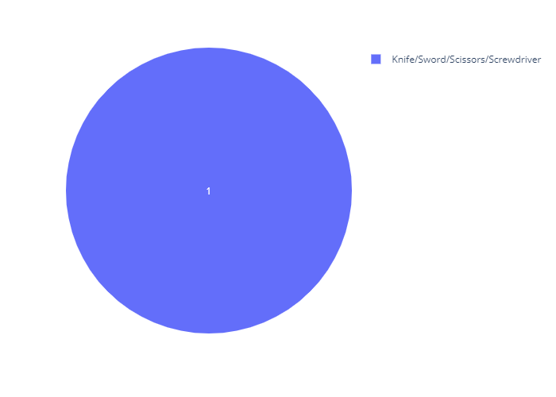

# Analysis of weapon types for violent crimes in NSW

Python code to analyze weapon types for violent crimes in NSW based on data from the NSW Bureau of Crime Statistics and Research.

# Loading libraries

Let's load relevant Python libraries.


```python
import numpy as np 
import pandas as pd 
import seaborn as sns
import matplotlib.pyplot as plt 
import matplotlib as mpl
import squarify
import plotly.io as pio
import plotly.express as px
from IPython.display import display, Markdown
import warnings
warnings.filterwarnings("ignore")
```

# Loading data

The dataset was acquired from https://www.bocsar.nsw.gov.au/.


```python
print(pd.ExcelFile('Weapons Statistics.xls').sheet_names)
```

    ['Sheet1']
    

There is only one sheet.


```python
data = pd.read_excel('Weapons Statistics.xls', 'Sheet1')
```


```python
data.head()
```


<div>
<table border="1" class="dataframe">
  <thead>
    <tr style="text-align: right;">
      <th></th>
      <th>NSW Recorded Crime Statistics January 2013 to December 2019</th>
      <th>Unnamed: 1</th>
      <th>Unnamed: 2</th>
      <th>Unnamed: 3</th>
      <th>Unnamed: 4</th>
      <th>Unnamed: 5</th>
      <th>Unnamed: 6</th>
      <th>Unnamed: 7</th>
      <th>Unnamed: 8</th>
      <th>Unnamed: 9</th>
    </tr>
  </thead>
  <tbody>
    <tr>
      <th>0</th>
      <td>NaN</td>
      <td>NaN</td>
      <td>NaN</td>
      <td>NaN</td>
      <td>NaN</td>
      <td>NaN</td>
      <td>NaN</td>
      <td>NaN</td>
      <td>NaN</td>
      <td>NaN</td>
    </tr>
    <tr>
      <th>1</th>
      <td>Number of incidents for selected offences agai...</td>
      <td>NaN</td>
      <td>NaN</td>
      <td>NaN</td>
      <td>NaN</td>
      <td>NaN</td>
      <td>NaN</td>
      <td>NaN</td>
      <td>NaN</td>
      <td>NaN</td>
    </tr>
    <tr>
      <th>2</th>
      <td>NaN</td>
      <td>NaN</td>
      <td>NaN</td>
      <td>NaN</td>
      <td>NaN</td>
      <td>NaN</td>
      <td>NaN</td>
      <td>NaN</td>
      <td>NaN</td>
      <td>NaN</td>
    </tr>
    <tr>
      <th>3</th>
      <td>Weapon type</td>
      <td>Offence type</td>
      <td>NaN</td>
      <td>Jan 2013 - Dec 2013</td>
      <td>Jan 2014 - Dec 2014</td>
      <td>Jan 2015 - Dec 2015</td>
      <td>Jan 2016 - Dec 2016</td>
      <td>Jan 2017 - Dec 2017</td>
      <td>Jan 2018 - Dec 2018</td>
      <td>Jan 2019 - Dec 2019</td>
    </tr>
    <tr>
      <th>4</th>
      <td>Firearms</td>
      <td>Homicide</td>
      <td>Murder *</td>
      <td>16</td>
      <td>23</td>
      <td>16</td>
      <td>15</td>
      <td>9</td>
      <td>9</td>
      <td>5</td>
    </tr>
  </tbody>
</table>
</div>


The first four rows need to be skipped because they are part of a header.


```python
data = pd.read_excel('Weapons Statistics.xls', 'Sheet1', skiprows=4)
```

We should be good to go.

# Data pre-processing


```python
data.head()
```


<div>
<table border="1" class="dataframe">
  <thead>
    <tr style="text-align: right;">
      <th></th>
      <th>Weapon type</th>
      <th>Offence type</th>
      <th>Unnamed: 2</th>
      <th>Jan 2013 - Dec 2013</th>
      <th>Jan 2014 - Dec 2014</th>
      <th>Jan 2015 - Dec 2015</th>
      <th>Jan 2016 - Dec 2016</th>
      <th>Jan 2017 - Dec 2017</th>
      <th>Jan 2018 - Dec 2018</th>
      <th>Jan 2019 - Dec 2019</th>
    </tr>
  </thead>
  <tbody>
    <tr>
      <th>0</th>
      <td>Firearms</td>
      <td>Homicide</td>
      <td>Murder *</td>
      <td>16.0</td>
      <td>23.0</td>
      <td>16.0</td>
      <td>15.0</td>
      <td>9.0</td>
      <td>9.0</td>
      <td>5.0</td>
    </tr>
    <tr>
      <th>1</th>
      <td>NaN</td>
      <td>NaN</td>
      <td>Attempted murder</td>
      <td>24.0</td>
      <td>10.0</td>
      <td>12.0</td>
      <td>8.0</td>
      <td>11.0</td>
      <td>8.0</td>
      <td>13.0</td>
    </tr>
    <tr>
      <th>2</th>
      <td>NaN</td>
      <td>NaN</td>
      <td>Manslaughter *</td>
      <td>0.0</td>
      <td>0.0</td>
      <td>0.0</td>
      <td>0.0</td>
      <td>0.0</td>
      <td>2.0</td>
      <td>1.0</td>
    </tr>
    <tr>
      <th>3</th>
      <td>NaN</td>
      <td>Assault</td>
      <td>Domestic violence related assault</td>
      <td>30.0</td>
      <td>37.0</td>
      <td>34.0</td>
      <td>35.0</td>
      <td>21.0</td>
      <td>23.0</td>
      <td>18.0</td>
    </tr>
    <tr>
      <th>4</th>
      <td>NaN</td>
      <td>NaN</td>
      <td>Non-domestic violence related assault</td>
      <td>145.0</td>
      <td>117.0</td>
      <td>129.0</td>
      <td>96.0</td>
      <td>101.0</td>
      <td>81.0</td>
      <td>83.0</td>
    </tr>
  </tbody>
</table>
</div>


```python
data.tail(10)
```


<div>
<table border="1" class="dataframe">
  <thead>
    <tr style="text-align: right;">
      <th></th>
      <th>Weapon type</th>
      <th>Offence type</th>
      <th>Unnamed: 2</th>
      <th>Jan 2013 - Dec 2013</th>
      <th>Jan 2014 - Dec 2014</th>
      <th>Jan 2015 - Dec 2015</th>
      <th>Jan 2016 - Dec 2016</th>
      <th>Jan 2017 - Dec 2017</th>
      <th>Jan 2018 - Dec 2018</th>
      <th>Jan 2019 - Dec 2019</th>
    </tr>
  </thead>
  <tbody>
    <tr>
      <th>107</th>
      <td>NaN</td>
      <td>Intimidation, stalking and harassment</td>
      <td>NaN</td>
      <td>75.0</td>
      <td>77.0</td>
      <td>81.0</td>
      <td>67.0</td>
      <td>83.0</td>
      <td>88.0</td>
      <td>78.0</td>
    </tr>
    <tr>
      <th>108</th>
      <td>NaN</td>
      <td>Other offences against the person</td>
      <td>NaN</td>
      <td>7.0</td>
      <td>10.0</td>
      <td>6.0</td>
      <td>6.0</td>
      <td>7.0</td>
      <td>9.0</td>
      <td>7.0</td>
    </tr>
    <tr>
      <th>109</th>
      <td>NaN</td>
      <td>NaN</td>
      <td>NaN</td>
      <td>NaN</td>
      <td>NaN</td>
      <td>NaN</td>
      <td>NaN</td>
      <td>NaN</td>
      <td>NaN</td>
      <td>NaN</td>
    </tr>
    <tr>
      <th>110</th>
      <td>Source: NSW Bureau of Crime Statistics and Res...</td>
      <td>NaN</td>
      <td>NaN</td>
      <td>NaN</td>
      <td>NaN</td>
      <td>NaN</td>
      <td>NaN</td>
      <td>NaN</td>
      <td>NaN</td>
      <td>NaN</td>
    </tr>
    <tr>
      <th>111</th>
      <td>Reference: kf20-18725</td>
      <td>NaN</td>
      <td>NaN</td>
      <td>NaN</td>
      <td>NaN</td>
      <td>NaN</td>
      <td>NaN</td>
      <td>NaN</td>
      <td>NaN</td>
      <td>NaN</td>
    </tr>
    <tr>
      <th>112</th>
      <td>Please retain this reference number for future...</td>
      <td>NaN</td>
      <td>NaN</td>
      <td>NaN</td>
      <td>NaN</td>
      <td>NaN</td>
      <td>NaN</td>
      <td>NaN</td>
      <td>NaN</td>
      <td>NaN</td>
    </tr>
    <tr>
      <th>113</th>
      <td>NOTE: Data sourced from the NSW Bureau of Crim...</td>
      <td>NaN</td>
      <td>NaN</td>
      <td>NaN</td>
      <td>NaN</td>
      <td>NaN</td>
      <td>NaN</td>
      <td>NaN</td>
      <td>NaN</td>
      <td>NaN</td>
    </tr>
    <tr>
      <th>114</th>
      <td>NaN</td>
      <td>NaN</td>
      <td>NaN</td>
      <td>NaN</td>
      <td>NaN</td>
      <td>NaN</td>
      <td>NaN</td>
      <td>NaN</td>
      <td>NaN</td>
      <td>NaN</td>
    </tr>
    <tr>
      <th>115</th>
      <td>NaN</td>
      <td>NaN</td>
      <td>NaN</td>
      <td>NaN</td>
      <td>NaN</td>
      <td>NaN</td>
      <td>NaN</td>
      <td>NaN</td>
      <td>NaN</td>
      <td>NaN</td>
    </tr>
    <tr>
      <th>116</th>
      <td>* Shows the number of victims not the number o...</td>
      <td>NaN</td>
      <td>NaN</td>
      <td>NaN</td>
      <td>NaN</td>
      <td>NaN</td>
      <td>NaN</td>
      <td>NaN</td>
      <td>NaN</td>
      <td>NaN</td>
    </tr>
  </tbody>
</table>
</div>


Rows with IDs higher than 108 need to be removed because they are part of the footer of the excel file.


```python
data = data[data.index<=108]
```

The 'Unnamed: 2' column is the offence subtype. We can just combined 'Offence type' and 'Unnamed: 2'.


```python
for i in range(len(data)):
    if str(data['Unnamed: 2'][i])!='nan':
        data['Offence type'][i] = data['Unnamed: 2'][i]
        data['Offence type'][i] = data['Offence type'][i].replace(' *', '')
data = data.drop(['Unnamed: 2'], axis=1)        
data.head()
```


<div>
<table border="1" class="dataframe">
  <thead>
    <tr style="text-align: right;">
      <th></th>
      <th>Weapon type</th>
      <th>Offence type</th>
      <th>Jan 2013 - Dec 2013</th>
      <th>Jan 2014 - Dec 2014</th>
      <th>Jan 2015 - Dec 2015</th>
      <th>Jan 2016 - Dec 2016</th>
      <th>Jan 2017 - Dec 2017</th>
      <th>Jan 2018 - Dec 2018</th>
      <th>Jan 2019 - Dec 2019</th>
    </tr>
  </thead>
  <tbody>
    <tr>
      <th>0</th>
      <td>Firearms</td>
      <td>Murder</td>
      <td>16.0</td>
      <td>23.0</td>
      <td>16.0</td>
      <td>15.0</td>
      <td>9.0</td>
      <td>9.0</td>
      <td>5.0</td>
    </tr>
    <tr>
      <th>1</th>
      <td>NaN</td>
      <td>Attempted murder</td>
      <td>24.0</td>
      <td>10.0</td>
      <td>12.0</td>
      <td>8.0</td>
      <td>11.0</td>
      <td>8.0</td>
      <td>13.0</td>
    </tr>
    <tr>
      <th>2</th>
      <td>NaN</td>
      <td>Manslaughter</td>
      <td>0.0</td>
      <td>0.0</td>
      <td>0.0</td>
      <td>0.0</td>
      <td>0.0</td>
      <td>2.0</td>
      <td>1.0</td>
    </tr>
    <tr>
      <th>3</th>
      <td>NaN</td>
      <td>Domestic violence related assault</td>
      <td>30.0</td>
      <td>37.0</td>
      <td>34.0</td>
      <td>35.0</td>
      <td>21.0</td>
      <td>23.0</td>
      <td>18.0</td>
    </tr>
    <tr>
      <th>4</th>
      <td>NaN</td>
      <td>Non-domestic violence related assault</td>
      <td>145.0</td>
      <td>117.0</td>
      <td>129.0</td>
      <td>96.0</td>
      <td>101.0</td>
      <td>81.0</td>
      <td>83.0</td>
    </tr>
  </tbody>
</table>
</div>


Now, we need to convert the dataframe into a multi-indexed dataframe. Before that, NaN values of 'Weapon type' needs to be replaced with the values of the respective previous roles. For example, 'Weapon type' of the the second row (id=1) shoould be 'Firearms' instead of 'NaN'.


```python
data.rename(columns={
    'Weapon type' : 'Weapon',
    'Offence type' : 'Offence',
    'Jan 2013 - Dec 2013' : '2013',
    'Jan 2014 - Dec 2014' : '2014',
    'Jan 2015 - Dec 2015' : '2015',
    'Jan 2016 - Dec 2016' : '2016',
    'Jan 2017 - Dec 2017' : '2017',
    'Jan 2018 - Dec 2018' : '2018',
    'Jan 2019 - Dec 2019' : '2019'    
}, inplace=True)
for i in range(1, len(data)):    
    if str(data.Weapon[i])=='nan':
        data.Weapon[i] = data.Weapon[i-1]
    data.Weapon[i] = data.Weapon[i].replace('\n', '')    
data.dropna(inplace=True)
data.set_index(['Weapon', 'Offence'], inplace=True)
data.head()
```


<div>
<table border="1" class="dataframe">
  <thead>
    <tr style="text-align: right;">
      <th></th>
      <th></th>
      <th>2013</th>
      <th>2014</th>
      <th>2015</th>
      <th>2016</th>
      <th>2017</th>
      <th>2018</th>
      <th>2019</th>
    </tr>
    <tr>
      <th>Weapon</th>
      <th>Offence</th>
      <th></th>
      <th></th>
      <th></th>
      <th></th>
      <th></th>
      <th></th>
      <th></th>
    </tr>
  </thead>
  <tbody>
    <tr>
      <th rowspan="5" valign="top">Firearms</th>
      <th>Murder</th>
      <td>16.0</td>
      <td>23.0</td>
      <td>16.0</td>
      <td>15.0</td>
      <td>9.0</td>
      <td>9.0</td>
      <td>5.0</td>
    </tr>
    <tr>
      <th>Attempted murder</th>
      <td>24.0</td>
      <td>10.0</td>
      <td>12.0</td>
      <td>8.0</td>
      <td>11.0</td>
      <td>8.0</td>
      <td>13.0</td>
    </tr>
    <tr>
      <th>Manslaughter</th>
      <td>0.0</td>
      <td>0.0</td>
      <td>0.0</td>
      <td>0.0</td>
      <td>0.0</td>
      <td>2.0</td>
      <td>1.0</td>
    </tr>
    <tr>
      <th>Domestic violence related assault</th>
      <td>30.0</td>
      <td>37.0</td>
      <td>34.0</td>
      <td>35.0</td>
      <td>21.0</td>
      <td>23.0</td>
      <td>18.0</td>
    </tr>
    <tr>
      <th>Non-domestic violence related assault</th>
      <td>145.0</td>
      <td>117.0</td>
      <td>129.0</td>
      <td>96.0</td>
      <td>101.0</td>
      <td>81.0</td>
      <td>83.0</td>
    </tr>
  </tbody>
</table>
</div>


We are good to go

# Trend analysis of annual total crimes involving weapons


```python
trend = data.sum(axis = 0) 
```


```python
trend.plot(kind = 'line', color = 'blue', linewidth=3,alpha = 1,grid = True,linestyle = '-')
plt.title('Annual total crimes involving weapons')
plt.xlabel('Year')              
plt.ylabel('Number of cases')
plt.show()
```


Interestingly, the total number of crimes involving weapons in NSW bottomed out in 2017 before rising again in 2018.

# Overall analysis of weapons


```python
weapons = data.groupby(level=[0]).sum()
weapons.head()
```


<div>
<table border="1" class="dataframe">
  <thead>
    <tr style="text-align: right;">
      <th></th>
      <th>2013</th>
      <th>2014</th>
      <th>2015</th>
      <th>2016</th>
      <th>2017</th>
      <th>2018</th>
      <th>2019</th>
    </tr>
    <tr>
      <th>Weapon</th>
      <th></th>
      <th></th>
      <th></th>
      <th></th>
      <th></th>
      <th></th>
      <th></th>
    </tr>
  </thead>
  <tbody>
    <tr>
      <th>Boomerang</th>
      <td>4.0</td>
      <td>2.0</td>
      <td>1.0</td>
      <td>4.0</td>
      <td>44.0</td>
      <td>1.0</td>
      <td>2.0</td>
    </tr>
    <tr>
      <th>Bow &amp; Arrow/Crossbow/Blow Gun</th>
      <td>16.0</td>
      <td>13.0</td>
      <td>11.0</td>
      <td>18.0</td>
      <td>6.0</td>
      <td>11.0</td>
      <td>10.0</td>
    </tr>
    <tr>
      <th>Brick/Rock/Stone/Missile</th>
      <td>244.0</td>
      <td>213.0</td>
      <td>174.0</td>
      <td>165.0</td>
      <td>181.0</td>
      <td>177.0</td>
      <td>178.0</td>
    </tr>
    <tr>
      <th>Club/Iron Bar/Pipe</th>
      <td>1129.0</td>
      <td>1033.0</td>
      <td>959.0</td>
      <td>945.0</td>
      <td>832.0</td>
      <td>912.0</td>
      <td>825.0</td>
    </tr>
    <tr>
      <th>Firearms</th>
      <td>644.0</td>
      <td>627.0</td>
      <td>511.0</td>
      <td>451.0</td>
      <td>392.0</td>
      <td>413.0</td>
      <td>432.0</td>
    </tr>
  </tbody>
</table>
</div>


```python
def Plot(weapon, color):
    weapon.plot(kind = 'line', color =color, linewidth=3,alpha = 1,grid = True,linestyle = '-')
    plt.title("")
    plt.xlabel('Year')              
    plt.ylabel('Number of cases')
    plt.show()
```


```python
np.random.seed(4)
colors = np.random.choice(list(mpl.colors.XKCD_COLORS.keys()), len(weapons.T.columns), replace=False)
for i, weapon in enumerate(weapons.T.columns):
    print("Trend of '" + weapon + "'")
    print()
    Plot(weapons.T[weapon], colors[i])
```

    Trend of 'Boomerang'
    
    


    Trend of 'Bow & Arrow/Crossbow/Blow Gun'
    
    


    Trend of 'Brick/Rock/Stone/Missile'
    
    


    Trend of 'Club/Iron Bar/Pipe'
    
    


    Trend of 'Firearms'
    
    


    Trend of 'Glass/Bottle'
    
    


    Trend of 'Hammer/Spanner/Wrench'
    
    


    Trend of 'Knife/Sword/Scissors/Screwdriver'
    
    


    Trend of 'Oleoresin Capsicum Spray'
    
    


    Trend of 'Other Prohibited Weapon/Danger'
    
    


    Trend of 'Rope/Wire/Whip Etc.'
    
    


    Trend of 'Syringe'
    
    


```python
overall = weapons.sum(axis=1).sort_values(ascending=False).copy()
print(overall)
```

    Weapon
    Knife/Sword/Scissors/Screwdriver    22092.0
    Club/Iron Bar/Pipe                   6635.0
    Glass/Bottle                         3712.0
    Firearms                             3470.0
    Other Prohibited Weapon/Danger       2327.0
    Hammer/Spanner/Wrench                1455.0
    Brick/Rock/Stone/Missile             1332.0
    Rope/Wire/Whip Etc.                   343.0
    Syringe                               301.0
    Bow & Arrow/Crossbow/Blow Gun          85.0
    Boomerang                              58.0
    Oleoresin Capsicum Spray               48.0
    dtype: float64
    


```python
labels = []
for i in range(len(overall)):
    labels.append(overall.index[i].replace('/', '/\n'))
    
overall.index = labels
```


```python
count_html_output = 1
def SaveAsHTML(fig):
    global count_html_output
    #fig.show()
    #pio.write_html(fig, file='src/' + str(count_html_output) + '.html', auto_open=False)
    #print ('<iframe id="igraph" scrolling="no" style="border:none;" seamless="seamless" src="src/' + str(count_html_output) + '.html" height="100%" width="100%"></iframe>')
    fig.write_image("src/" + str(count_html_output) + ".png")
    display(Markdown(" + ".png)"))
    count_html_output = count_html_output + 1
```


```python
fig = px.treemap(overall.to_frame('Cases').reset_index(), 
                 path=['index'], 
                 values='Cases',      
                 hover_data=['Cases'],
                 color_continuous_scale='ice',
                 color='Cases'
                )
SaveAsHTML(fig)
```


Knife and other stabbing weapons are mostly used in violent crimes. Interestingly, bows, arrows and boomerangs are also used.


```python
plt.figure(figsize=(10,15))
sns.barplot(x=overall, y=overall.index, orient='h', palette='inferno' )
plt.xticks(rotation=90)
plt.title('Types of weapons used')
plt.show()
```


# Analysis of types of weapons for various crimes


```python
weaponoffence = data.sum(axis=1)
print(weaponoffence)
```

    Weapon                          Offence                              
    Firearms                        Murder                                    93.0
                                    Attempted murder                          86.0
                                    Manslaughter                               3.0
                                    Domestic violence related assault        198.0
                                    Non-domestic violence related assault    752.0
                                                                             ...  
    Other Prohibited Weapon/Danger  Sexual offences                            3.0
                                    Abduction and kidnapping                  17.0
                                    Robbery                                  290.0
                                    Intimidation, stalking and harassment    549.0
                                    Other offences against the person         52.0
    Length: 108, dtype: float64
    

### Overall


```python
fig = px.treemap(weaponoffence.to_frame('Cases').reset_index(), 
                 path=['Offence', 'Weapon'], 
                 values='Cases',
                 hover_data=['Cases'],                 
                 color='Cases'
                )
SaveAsHTML(fig)
```


```python
unstacked = weaponoffence.unstack(level=1).fillna(0)
for crime in unstacked.columns:
    display(Markdown("### Weapons used for '" + crime + "'"))
    np.random.seed(9)
    
    values = []
    labels = []
    sorteddata = unstacked[crime].sort_values(ascending=False);
    for i, row in enumerate(sorteddata):
        if row==0:
            break;
        values.append(row)
        labels.append(sorteddata.index[i])
    
    df = pd.DataFrame(
     {'Cases': values,
     'Weapon': labels,     
    })
    
    print(df.set_index('Weapon'))
    
    fig.update_traces(textinfo='value')
    
    fig1 = px.treemap(df, 
                 path=['Weapon'], 
                 values='Cases',      
                 hover_data=['Cases'],                
                 color_continuous_scale='earth',
                 color='Cases'
                )
    SaveAsHTML(fig1)
    
    fig2 = px.pie(df, 
                  values='Cases', 
                  names='Weapon'               
                 )
    fig2.update_traces(textinfo='value')
    SaveAsHTML(fig2)
    
    print()
    print()
  
    
```


### Weapons used for 'Abduction and kidnapping'


                                      Cases
    Weapon                                 
    Knife/Sword/Scissors/Screwdriver  198.0
    Firearms                          103.0
    Club/Iron Bar/Pipe                 35.0
    Hammer/Spanner/Wrench              20.0
    Other Prohibited Weapon/Danger     17.0
    Rope/Wire/Whip Etc.                 6.0
    Glass/Bottle                        6.0
    Syringe                             4.0
    Brick/Rock/Stone/Missile            1.0
    Bow & Arrow/Crossbow/Blow Gun       1.0
    


    
    
    


### Weapons used for 'Assault Police'


                                      Cases
    Weapon                                 
    Knife/Sword/Scissors/Screwdriver   57.0
    Glass/Bottle                       34.0
    Club/Iron Bar/Pipe                 16.0
    Brick/Rock/Stone/Missile           14.0
    Other Prohibited Weapon/Danger     10.0
    Oleoresin Capsicum Spray            4.0
    Hammer/Spanner/Wrench               4.0
    Rope/Wire/Whip Etc.                 3.0
    Firearms                            3.0
    Boomerang                           1.0
    


    
    
    


### Weapons used for 'Attempted murder'


                                      Cases
    Weapon                                 
    Firearms                           86.0
    Knife/Sword/Scissors/Screwdriver   45.0
    Hammer/Spanner/Wrench               4.0
    Other Prohibited Weapon/Danger      2.0
    Syringe                             1.0
    Club/Iron Bar/Pipe                  1.0
    Bow & Arrow/Crossbow/Blow Gun       1.0
    


    
    
    


### Weapons used for 'Blackmail and extortion'


                                      Cases
    Weapon                                 
    Firearms                           21.0
    Knife/Sword/Scissors/Screwdriver   10.0
    Club/Iron Bar/Pipe                  4.0
    


    
    
    


### Weapons used for 'Domestic violence related assault'


                                       Cases
    Weapon                                  
    Knife/Sword/Scissors/Screwdriver  5375.0
    Club/Iron Bar/Pipe                1574.0
    Glass/Bottle                      1075.0
    Other Prohibited Weapon/Danger     460.0
    Brick/Rock/Stone/Missile           350.0
    Hammer/Spanner/Wrench              289.0
    Rope/Wire/Whip Etc.                212.0
    Firearms                           198.0
    Syringe                             25.0
    Oleoresin Capsicum Spray            12.0
    Bow & Arrow/Crossbow/Blow Gun       12.0
    Boomerang                            8.0
    


    
    
    


### Weapons used for 'Intimidation, stalking and harassment'


                                       Cases
    Weapon                                  
    Knife/Sword/Scissors/Screwdriver  5748.0
    Club/Iron Bar/Pipe                1120.0
    Firearms                           726.0
    Other Prohibited Weapon/Danger     549.0
    Hammer/Spanner/Wrench              372.0
    Glass/Bottle                       189.0
    Brick/Rock/Stone/Missile           159.0
    Boomerang                           44.0
    Bow & Arrow/Crossbow/Blow Gun       41.0
    Syringe                             26.0
    Rope/Wire/Whip Etc.                 13.0
    


    
    
    


### Weapons used for 'Manslaughter'


                                      Cases
    Weapon                                 
    Firearms                            3.0
    Knife/Sword/Scissors/Screwdriver    2.0
    Syringe                             1.0
    


    
    
    


### Weapons used for 'Murder'


                                      Cases
    Weapon                                 
    Knife/Sword/Scissors/Screwdriver  175.0
    Firearms                           93.0
    Club/Iron Bar/Pipe                 18.0
    Other Prohibited Weapon/Danger     12.0
    Hammer/Spanner/Wrench               7.0
    Glass/Bottle                        3.0
    Brick/Rock/Stone/Missile            3.0
    Syringe                             2.0
    Rope/Wire/Whip Etc.                 1.0
    


    
    
    


### Weapons used for 'Murder accessory, conspiracy'


                                      Cases
    Weapon                                 
    Knife/Sword/Scissors/Screwdriver    1.0
    





    
    
    


### Weapons used for 'Non-domestic violence related assault'


                                       Cases
    Weapon                                  
    Knife/Sword/Scissors/Screwdriver  4892.0
    Club/Iron Bar/Pipe                3140.0
    Glass/Bottle                      2177.0
    Other Prohibited Weapon/Danger     932.0
    Firearms                           752.0
    Brick/Rock/Stone/Missile           714.0
    Hammer/Spanner/Wrench              491.0
    Syringe                             94.0
    Rope/Wire/Whip Etc.                 89.0
    Bow & Arrow/Crossbow/Blow Gun       28.0
    Oleoresin Capsicum Spray            27.0
    Boomerang                            4.0
    


    
    
    


### Weapons used for 'Other offences against the person'


                                      Cases
    Weapon                                 
    Knife/Sword/Scissors/Screwdriver  235.0
    Club/Iron Bar/Pipe                 73.0
    Other Prohibited Weapon/Danger     52.0
    Firearms                           48.0
    Glass/Bottle                       32.0
    Brick/Rock/Stone/Missile           32.0
    Hammer/Spanner/Wrench              18.0
    Syringe                             2.0
    Rope/Wire/Whip Etc.                 2.0
    Bow & Arrow/Crossbow/Blow Gun       1.0
    


    
    
    


### Weapons used for 'Robbery'


                                       Cases
    Weapon                                  
    Knife/Sword/Scissors/Screwdriver  5197.0
    Firearms                          1416.0
    Club/Iron Bar/Pipe                 647.0
    Other Prohibited Weapon/Danger     290.0
    Hammer/Spanner/Wrench              246.0
    Glass/Bottle                       186.0
    Syringe                            139.0
    Brick/Rock/Stone/Missile            59.0
    Rope/Wire/Whip Etc.                  6.0
    Oleoresin Capsicum Spray             5.0
    Bow & Arrow/Crossbow/Blow Gun        1.0
    Boomerang                            1.0
    


    
    
    


### Weapons used for 'Sexual offences'


                                      Cases
    Weapon                                 
    Knife/Sword/Scissors/Screwdriver  157.0
    Firearms                           21.0
    Rope/Wire/Whip Etc.                11.0
    Glass/Bottle                       10.0
    Syringe                             7.0
    Club/Iron Bar/Pipe                  7.0
    Hammer/Spanner/Wrench               4.0
    Other Prohibited Weapon/Danger      3.0
    


    
    
    

# Analysis of crimes committed using various weapons

### Overall


```python
fig = px.treemap(weaponoffence.to_frame('Cases').reset_index(), 
                 path=['Weapon', 'Offence'], 
                 values='Cases',
                 color='Cases'
                )
SaveAsHTML(fig)
```


```python
unstacked = weaponoffence.unstack(level=0).fillna(0)
for weapon in unstacked.columns:
    display(Markdown("### Crimes committed using '" + weapon + "'"))
    np.random.seed(9)
    
    values = []
    labels = []
    sorteddata = unstacked[weapon].sort_values(ascending=False);
    for i, row in enumerate(sorteddata):
        if row==0:
            break;
        values.append(row)
        labels.append(sorteddata.index[i])
    
       
    df = pd.DataFrame(
     {'Cases': values,
     'Crime': labels,     
    })
    
    print(df.set_index('Crime'))
    
    fig.update_traces(textinfo='value')
    
    fig1 = px.treemap(df, 
                 path=['Crime'], 
                 values='Cases',      
                 hover_data=['Cases'],
                 color_continuous_scale='algae',
                 color='Cases'
                )
    SaveAsHTML(fig1)
    
    fig2 = px.pie(df, 
                  values='Cases', 
                  names='Crime',
                 color_discrete_sequence=px.colors.diverging.Portland
                 )
    fig2.update_traces(textinfo='value')
    SaveAsHTML(fig2)
    
    print()
    print()
   
    
```


### Crimes committed using 'Boomerang'


                                           Cases
    Crime                                       
    Intimidation, stalking and harassment   44.0
    Domestic violence related assault        8.0
    Non-domestic violence related assault    4.0
    Robbery                                  1.0
    Assault Police                           1.0
    


    
    
    


### Crimes committed using 'Bow & Arrow/Crossbow/Blow Gun'


                                           Cases
    Crime                                       
    Intimidation, stalking and harassment   41.0
    Non-domestic violence related assault   28.0
    Domestic violence related assault       12.0
    Robbery                                  1.0
    Other offences against the person        1.0
    Attempted murder                         1.0
    Abduction and kidnapping                 1.0
    


    
    
    


### Crimes committed using 'Brick/Rock/Stone/Missile'


                                           Cases
    Crime                                       
    Non-domestic violence related assault  714.0
    Domestic violence related assault      350.0
    Intimidation, stalking and harassment  159.0
    Robbery                                 59.0
    Other offences against the person       32.0
    Assault Police                          14.0
    Murder                                   3.0
    Abduction and kidnapping                 1.0
    


    
    
    


### Crimes committed using 'Club/Iron Bar/Pipe'


                                            Cases
    Crime                                        
    Non-domestic violence related assault  3140.0
    Domestic violence related assault      1574.0
    Intimidation, stalking and harassment  1120.0
    Robbery                                 647.0
    Other offences against the person        73.0
    Abduction and kidnapping                 35.0
    Murder                                   18.0
    Assault Police                           16.0
    Sexual offences                           7.0
    Blackmail and extortion                   4.0
    Attempted murder                          1.0
    


    
    
    


### Crimes committed using 'Firearms'


                                            Cases
    Crime                                        
    Robbery                                1416.0
    Non-domestic violence related assault   752.0
    Intimidation, stalking and harassment   726.0
    Domestic violence related assault       198.0
    Abduction and kidnapping                103.0
    Murder                                   93.0
    Attempted murder                         86.0
    Other offences against the person        48.0
    Sexual offences                          21.0
    Blackmail and extortion                  21.0
    Manslaughter                              3.0
    Assault Police                            3.0
    


    
    
    


### Crimes committed using 'Glass/Bottle'


                                            Cases
    Crime                                        
    Non-domestic violence related assault  2177.0
    Domestic violence related assault      1075.0
    Intimidation, stalking and harassment   189.0
    Robbery                                 186.0
    Assault Police                           34.0
    Other offences against the person        32.0
    Sexual offences                          10.0
    Abduction and kidnapping                  6.0
    Murder                                    3.0
    


    
    
    


### Crimes committed using 'Hammer/Spanner/Wrench'


                                           Cases
    Crime                                       
    Non-domestic violence related assault  491.0
    Intimidation, stalking and harassment  372.0
    Domestic violence related assault      289.0
    Robbery                                246.0
    Abduction and kidnapping                20.0
    Other offences against the person       18.0
    Murder                                   7.0
    Sexual offences                          4.0
    Attempted murder                         4.0
    Assault Police                           4.0
    


    
    
    


### Crimes committed using 'Knife/Sword/Scissors/Screwdriver'


                                            Cases
    Crime                                        
    Intimidation, stalking and harassment  5748.0
    Domestic violence related assault      5375.0
    Robbery                                5197.0
    Non-domestic violence related assault  4892.0
    Other offences against the person       235.0
    Abduction and kidnapping                198.0
    Murder                                  175.0
    Sexual offences                         157.0
    Assault Police                           57.0
    Attempted murder                         45.0
    Blackmail and extortion                  10.0
    Manslaughter                              2.0
    Murder accessory, conspiracy              1.0
    


    
    
    


### Crimes committed using 'Oleoresin Capsicum Spray'


                                           Cases
    Crime                                       
    Non-domestic violence related assault   27.0
    Domestic violence related assault       12.0
    Robbery                                  5.0
    Assault Police                           4.0
    


    
    
    


### Crimes committed using 'Other Prohibited Weapon/Danger'


                                           Cases
    Crime                                       
    Non-domestic violence related assault  932.0
    Intimidation, stalking and harassment  549.0
    Domestic violence related assault      460.0
    Robbery                                290.0
    Other offences against the person       52.0
    Abduction and kidnapping                17.0
    Murder                                  12.0
    Assault Police                          10.0
    Sexual offences                          3.0
    Attempted murder                         2.0
    


    
    
    


### Crimes committed using 'Rope/Wire/Whip Etc.'


                                           Cases
    Crime                                       
    Domestic violence related assault      212.0
    Non-domestic violence related assault   89.0
    Intimidation, stalking and harassment   13.0
    Sexual offences                         11.0
    Robbery                                  6.0
    Abduction and kidnapping                 6.0
    Assault Police                           3.0
    Other offences against the person        2.0
    Murder                                   1.0
    


    
    
    


### Crimes committed using 'Syringe'


                                           Cases
    Crime                                       
    Robbery                                139.0
    Non-domestic violence related assault   94.0
    Intimidation, stalking and harassment   26.0
    Domestic violence related assault       25.0
    Sexual offences                          7.0
    Abduction and kidnapping                 4.0
    Other offences against the person        2.0
    Murder                                   2.0
    Manslaughter                             1.0
    Attempted murder                         1.0
    


    
    
    
